# Real Estate Marketplace

## Introduction
The Real Estate Marketplace platform aims to revolutionize the Bulgarian real estate market by offering a superior user experience (UX) and user interface (UI). The platform integrates cutting-edge technologies like Artificial Intelligence (AI) and provides comprehensive features such as intelligent property listings, efficient search capabilities, and seamless company management tools.

### Project Goals
- Create a robust and innovative marketplace platform with superior UX/UI.
- Incorporate cutting-edge technologies like AI for text generation and address management.
- Stand out in the current market through exceptional search functionality and modern feature integrations.

### Key Technologies
- **Frontend**: React with TypeScript for a highly interactive UI.
- **Backend**: Next.js for server-side rendering.
- **AI Tools**: OpenAI for intelligent property description generation.
- **External Services**: Google Places API, Google Maps, and Firebase Auth.

### Project Features
- **User-Friendly Interface**: Easy navigation and intuitive design.
- **AI-Enhanced Listings**: AI tools assist in generating descriptive and appealing property listings.
- **Search Capabilities**: Supports English and Cyrillic scripts, along with advanced filters.
- **Multi-Environment Support**: Seamlessly runs in different environments.
- **Company Management**: Establish and manage companies and members efficiently.

## Requirements
### System Requirements
- **D-SYS-01**: The system must have a user-friendly interface with easy navigation.
- **D-SYS-02**: The website must be robust, utilizing typed languages on both the frontend and backend.
- **D-SYS-03**: The application must support multiple running environments.
- **D-SYS-04**: The system must have a simple and efficient search process.
- **D-SYS-05**: The application must have pagination implemented for listings on the listings page.
- **D-SYS-06**: The system should provide users with an easy link to the company's Viber and WhatsApp.
- **D-SYS-07**: The system should support email sending.
- **D-SYS-08**: The system should have a caching mechanism implemented.

### User Requirements
- **D-USER-01**: Users must be able to search locations using both English and Cyrillic scripts.
- **D-USER-02**: Authenticated users should be able to remove houses from a wishlist.
- **D-USER-03**: Authenticated users should be able to save searches to receive notifications for matching properties.
- **D-USER-04**: Authenticated users should be able to delete previously saved searches.
- **D-USER-05**: Users can create their company in the application.
- **D-USER-06**: Users can invite other users to their company.
- **D-USER-07**: Users can accept or deny other users' invites to join a company.
- **D-USER-08**: Users of a company can view, edit, and delete properties of the company.
- **D-USER-09**: Users must be able to view the contact details of other users on the website.
- **D-USER-10**: Users must be able to view properties of other users.
- **D-USER-11**: Users must be able to change their account details.

### User Stories
- **General Users**
    1. View property listings without signing in.
    2. Apply filters to listings to quickly find properties that match preferences.
    3. See a property's exact location on a map.
    4. View a property's change in price over time.
    5. Access Viber, WhatsApp, and email easily for support.

- **Registered Users**
    6. View properties recently checked out.
    7. Save properties to a wishlist.
    8. Save specific property searches and receive notifications.
    9. Establish a company and manage member invitations.
    10. Edit account details.

- **Sellers/Brokers**
    11. Post property advertisements through a user-friendly web interface or API.
    12. Modify or delete property advertisements.
    13. Receive AI assistance in creating appealing property descriptions.

- **Company Members**
    14. View, edit, or delete company properties.

- **Developers**
    15. The platform has a CI/CD pipeline for efficient and safe deployment.
    16. The platform uses typed languages on both the frontend and backend.
    17. The platform has caching mechanisms implemented.

## Prerequisites
- **Docker & Docker Compose**
- **Node.js & npm**
- **Firebase Auth Emulator** (from a separate project)

### Firebase Auth Emulator
To ensure authentication works correctly, ensure the Firebase Auth Emulator is running. This emulator is part of a separate project. Make sure to start the Firebase Auth Emulator before starting this application.

## Environment Setup
Before running the project, ensure you have set up your environment variables. Copy the contents of the `.env.example` file to the corresponding `.env` files. Adjust the variables if necessary to fit your local or production environment.

## Running the Application
### With Docker
You can run the project with Docker Compose. However, it's recommended to run only the `db`, `pgadmin`, and `redis` containers using Docker. The application itself should be run via the standard development command to leverage hot-reloading and other features.

To run the recommended containers via Docker Compose:
```bash
docker-compose up db pgadmin redis
```

### Without Docker
With the database, pgAdmin, and Redis running through Docker, you can now start the application:
```bash
# Install dependencies
npm install

# Start the Next.js development server with hot-reloading enabled
npm run dev
```

Open http://localhost:3000 with your browser to see the result.

### Contact
For any questions or feedback, feel free to reach me out at:
Email: misha.galenda@gmail.com

## Diagrams
### Architecture Diagram
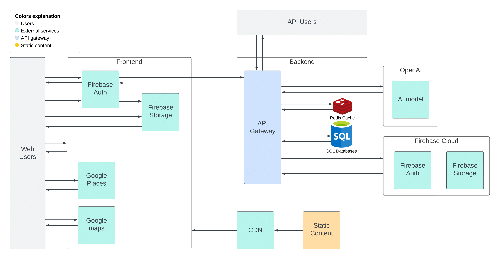

### Database Design
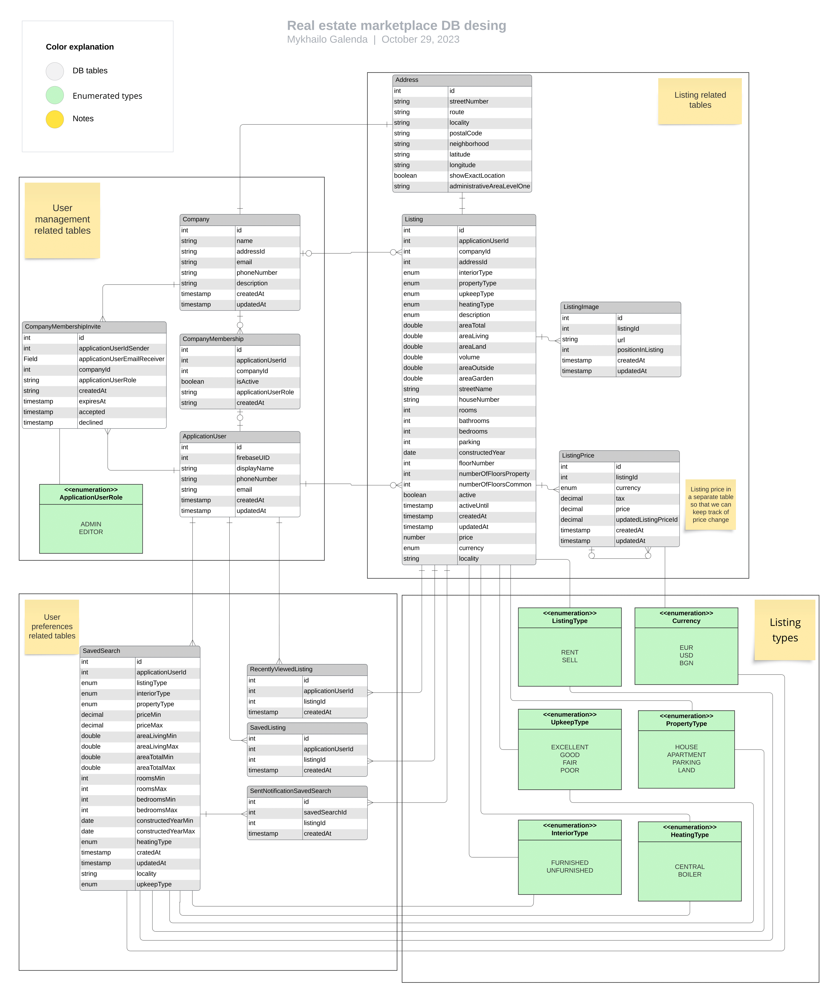

### Authentication and authorization component diagram
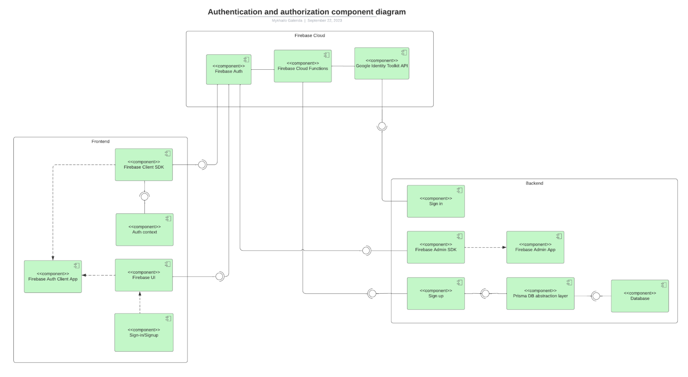


### Registration process sequence diagram
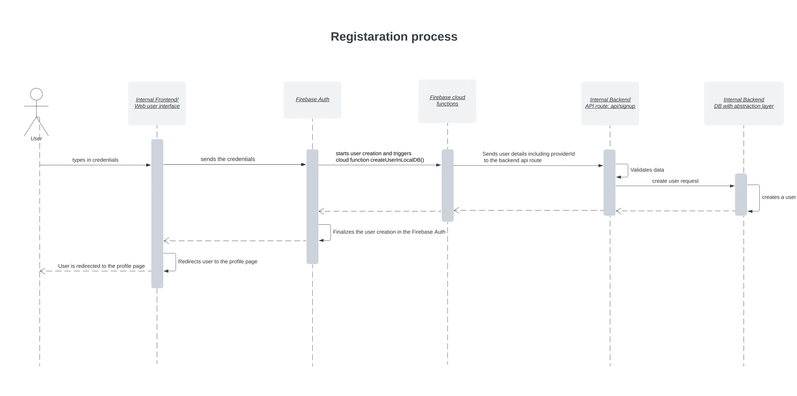

### AI text generation sequence diagram
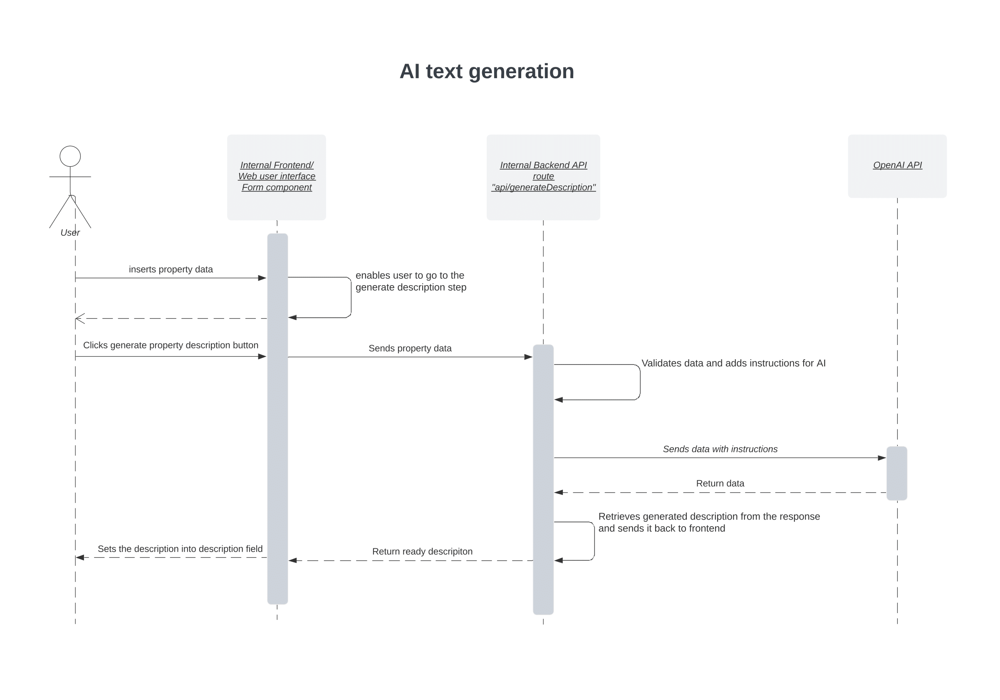

### Google places autocomplete sequence diagram
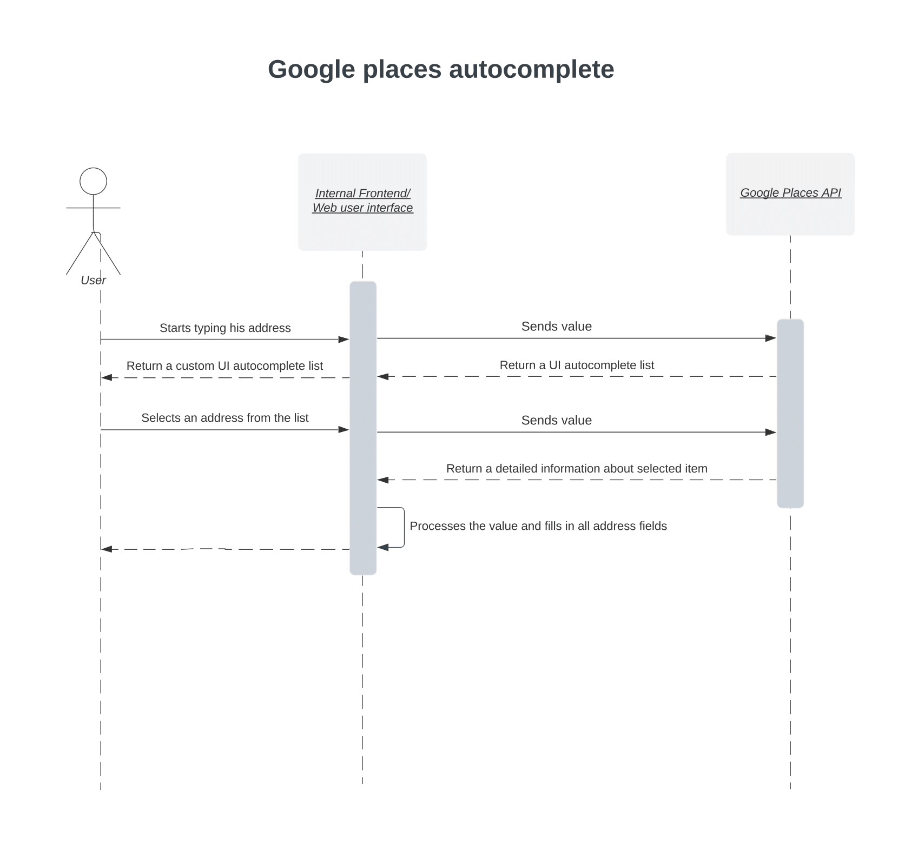

### Google places autocomplete sequence diagram


### Notification service sequence diagram
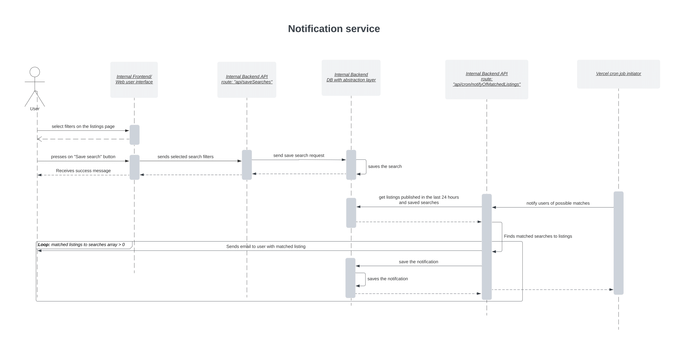

## User Interface
### Home Page
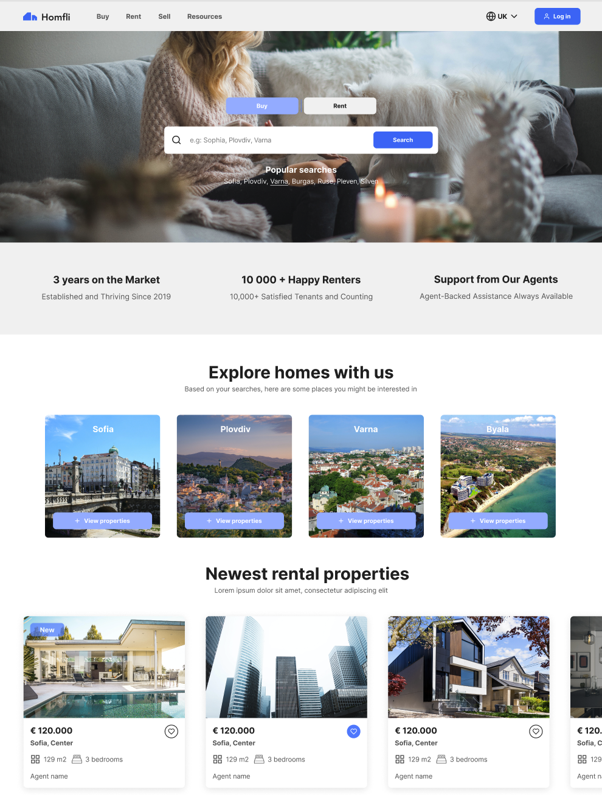

### Listings Page
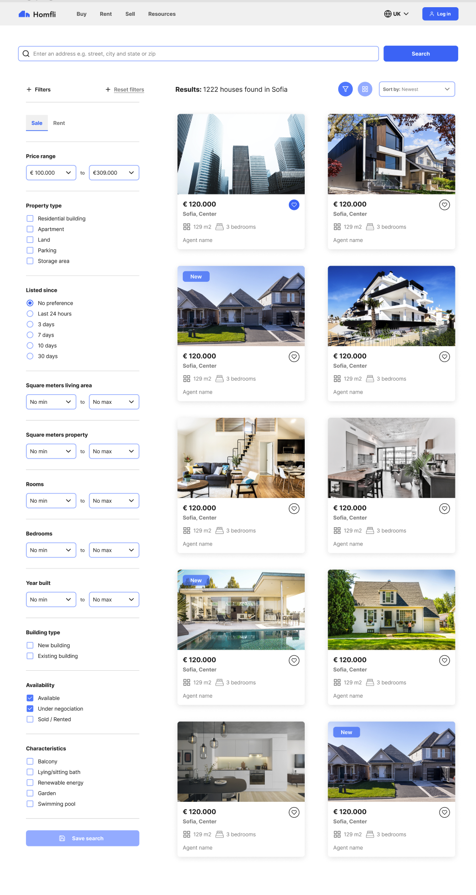

### TODO add listing page view

### Listings items
#### Recently viewed items
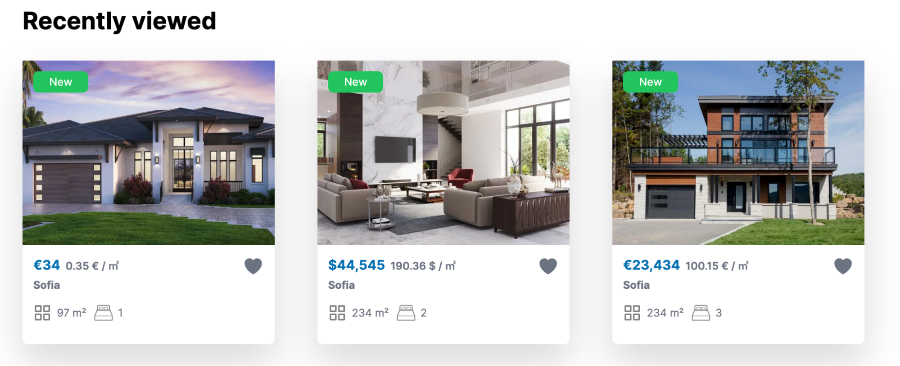

#### Saved items
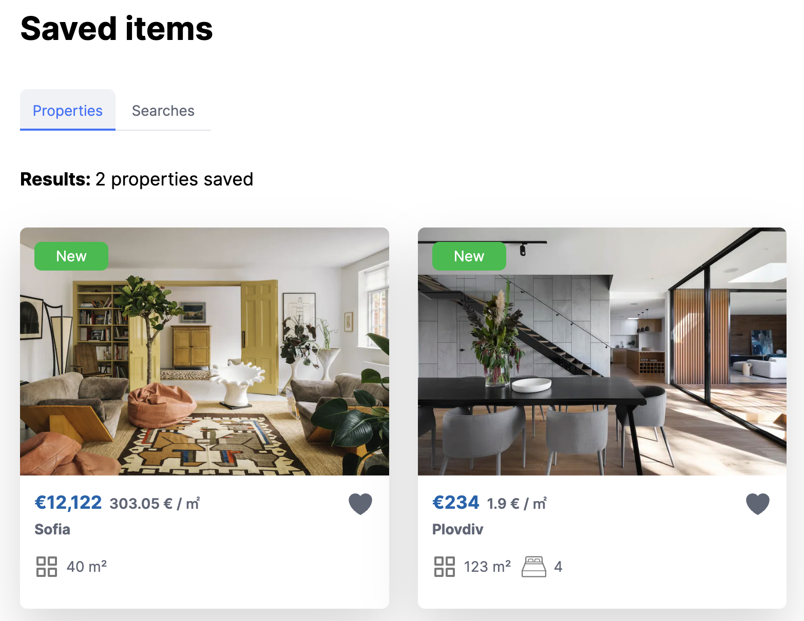

### Loading state
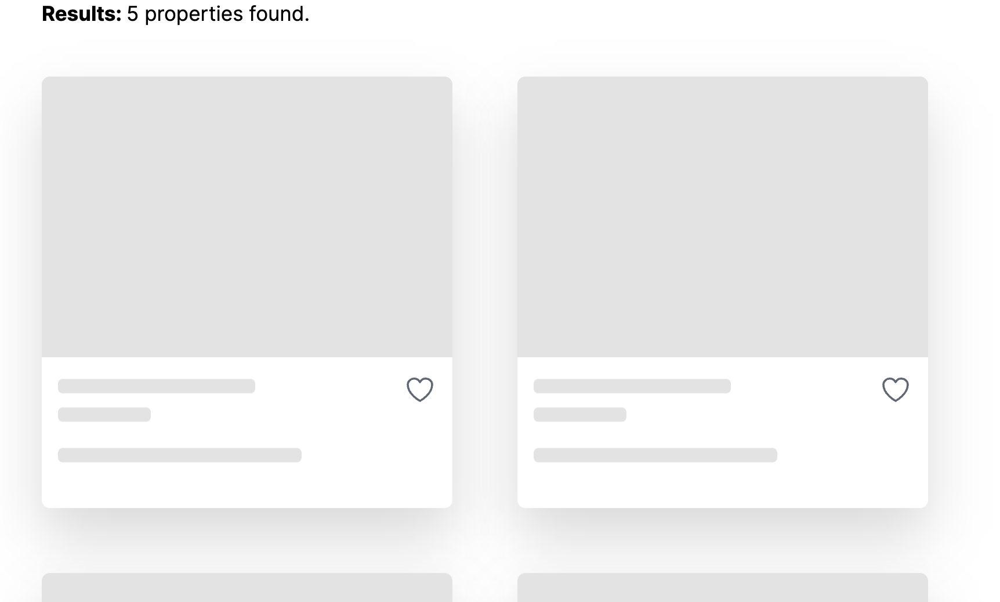

## User flows
### Finding a property
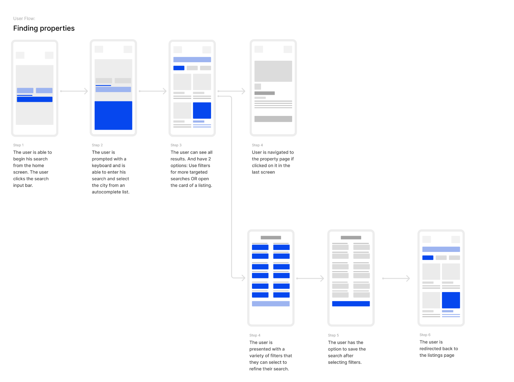

## Low fidelity wireframes
### Listing page
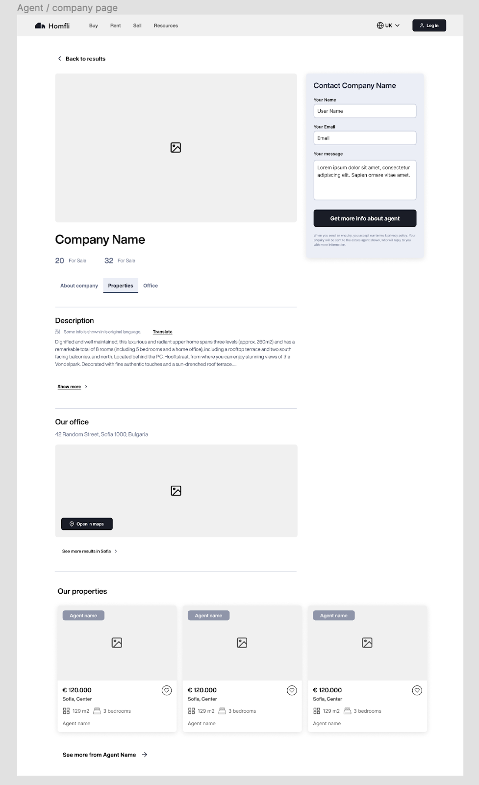