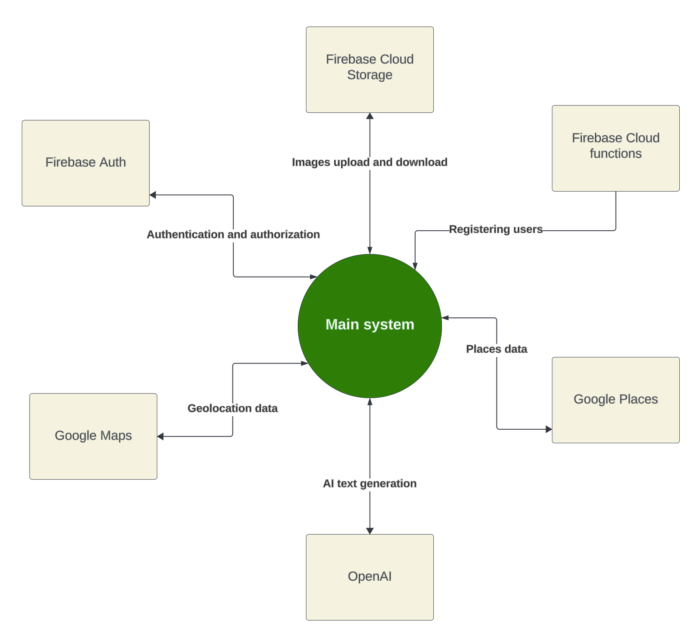
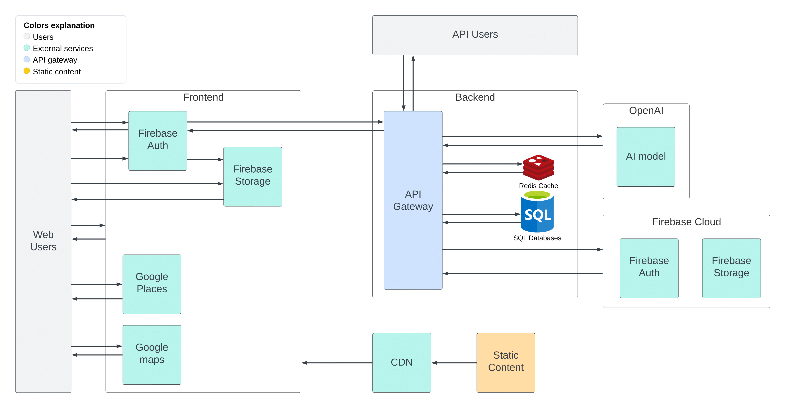
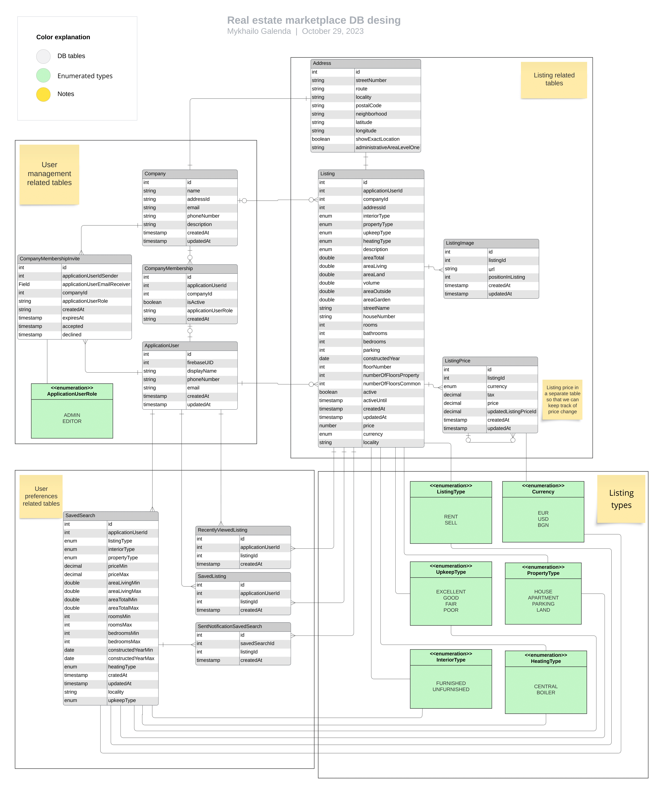
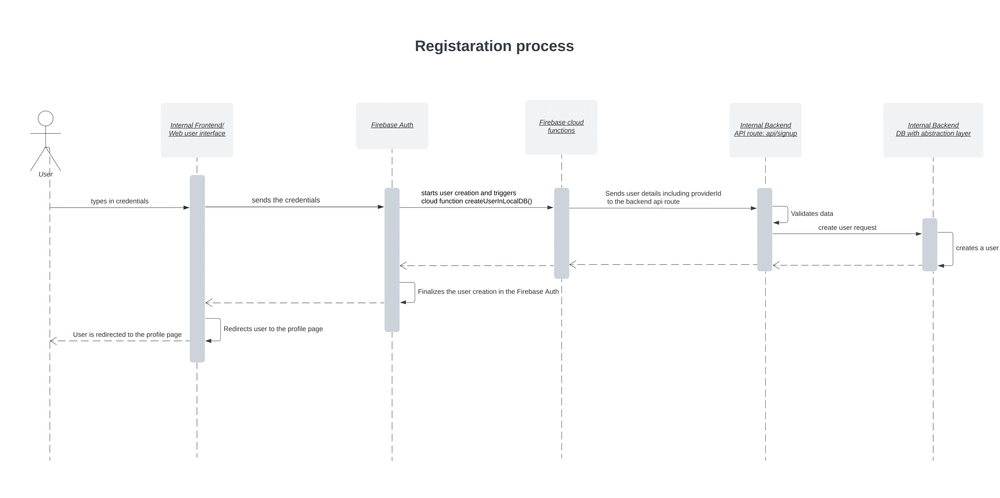
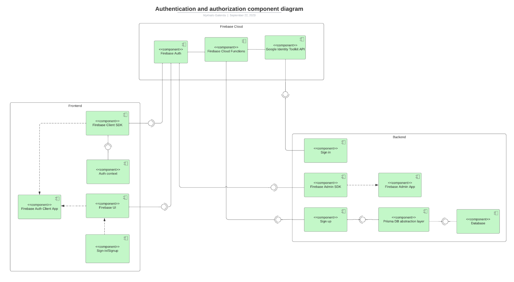
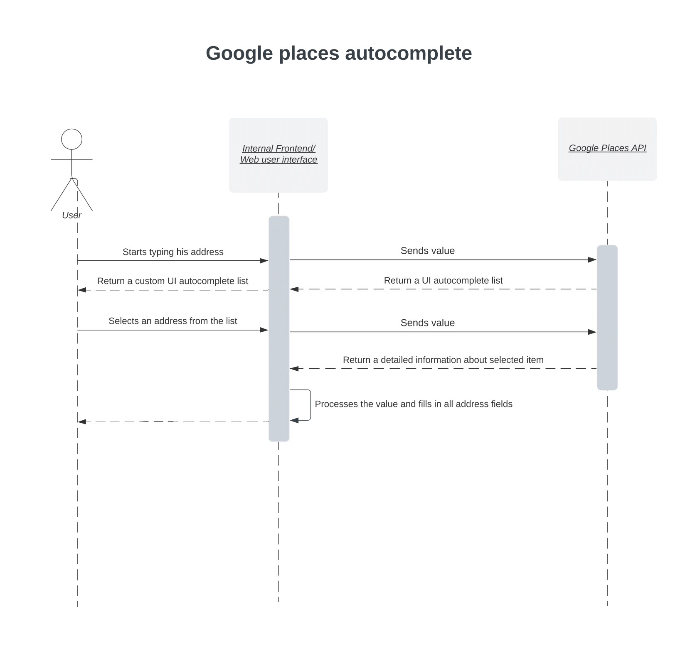
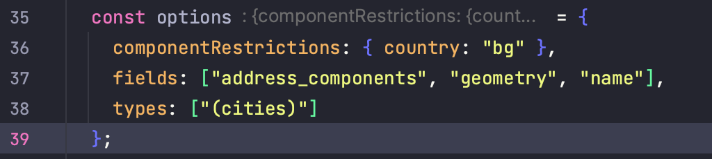
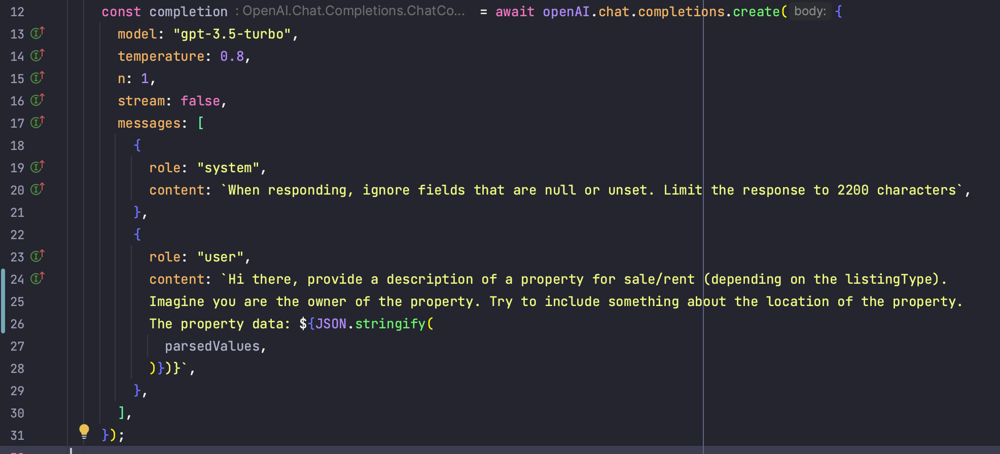
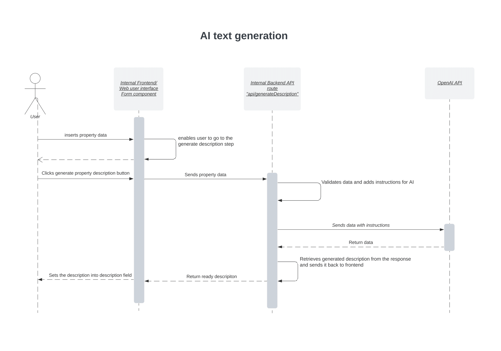

# Technical documentation
## Context diagram
Below is the context diagram that represents the communication the application has with external services.
xc
The explanation of the services used is present in the following sections



## Architecture diagram
Below is the high-level application architecture diagram.

An explanation of the services used is present in the following sections.




## Database diagram
The application's database diagram is shown below in this chapter.

The organization of the database can fundamentally be divided into four distinct sections, each serving specific functional purposes:

User management tables
These are primarily focused on managing user information and include the Company, CompanyMembership, and ApplicationUser tables.

User preferences-related tables
These tables, namely RecentlyViewedListings, SavedListings, SavedSearches, and SentNotificationSavedSearch, are designed to hold data related to the user’s specific preferences.

Enumerated types: These tables manage different aspects and types related to listings.

Listing-related tables: This segment, which includes the Listing, ListingImage, Address, and ListingPrice tables, is primarily concerned with managing various aspects of listing.

The diagram of the database has a visual system where various items are differentiated using distinct colors. To ensure clarity, a "Color explanation" guide is positioned at the top left corner. Tables related to specific processes or activities are framed together.

A noticeable characteristic of the design is the extensive use of enum types. These were chosen over traditional SQL tables for the following reasons:
First, the application has numerous types that are defined with a limited set of values. These values are not expected to change in the future, making enums a suitable choice for maintaining stability.
Second, tracking and referencing enum values within the software is more straightforward and efficient than navigating through SQL tables to match IDs with their corresponding values.
Third, for consumers of the API, enum types provide a clear set of available readable values rather than ID numbers, making the API more self-descriptive. 





## Data management
### Persistent Data Storage with SQL Postgres and Prisma ORM
Application uses persistent data storage. To implement this, the SQL Postgres database is being utilized. To interact with the database efficiently and to avoid the use of raw SQL statements, Prisma Object–Relational Mapping (ORM) is used. Prisma “provides an abstraction layer between the database and the application.” (Should You Use Prisma as a Node.js/TypeScript ORM?, 2023).
Prisma was chosen as the ORM solution over others like Sequelize and TypeORM due to the following key factors:
Comprehensive feature set: Prisma stands out with its extensive features such as advanced filtering, sorting, and pagination, allowing for the development of more robust and versatile applications.
Intuitive developer experience: Prisma’s developer-friendly and intuitive syntax facilitates more readable and maintainable code
Enhanced type safety: Prisma provides type safety with TypeScript, minimizing runtime errors and improving code quality.

The declaration of the database design is done in the schema.prisma file located in the "prisma" folder at the root level of the application. After declaration, a backend Prisma client is generated. It allows for easy manipulation of the database thanks to its auto-suggestion feature and user-friendly syntax.

### Backend data caching
To optimize performance and reduce the load on the database, data caching is implemented on the backend using Redis. Redis is “the open source, in-memory data store used by millions of developers as a database, cache, streaming engine, and message broker” (Redis, 2023). Prisma supports various middleware, and to integrate Redis with Prisma, the “prisma-redis-middleware” library is utilized. During the creation of a Prisma client, Redis is specified as the caching tool, tables to be cached and the duration of the cache is also mentioned at this stage.

### Soft deletion implementation
Regarding data deletion, soft deletion has been implemented for listing table. Instead of complete data removal, a ‘deleted’ property is added to the listing in the database, preserving the listing for future references while making it unavailable to the user. When a user opts to delete a listing, a timestamp is recorded in the ‘deleted’ property, implemented through Prisma middleware. This enables the usage of Prisma’s regular delete function but with the added benefit of preserving the data as described.

### Frontend data caching with React-Query
Data caching is also implemented on the frontend using the "react-query" library to reduce the load on the backend server and enhance user experience by reducing load times. With react-query, a function specifying the route to fetch certain data is declared in one place. Components then utilize this function, ensuring data is fetched and cached automatically.

## Authentication and authorization
For user management, authentication, and authorization, the Firebase Auth is being utilized. The application provides the possibility to sign in/sign up with an email and password or a Google account. In the end of this section, a component diagram of authentication and authorization is included.

### Initial setup
Initial configuration and integration of Firebase-related services are executed in the Firebase console, where the specified sign-in methods are also set up.


### Frontend authentication
On the frontend, user authentication is managed through the Firebase client SDK, with all auth changes tracked and managed within the AuthContext.tsx file. This file tracks authentication status and makes it accessible to the rest of the application's components.

### Backend authentication
For the backend and server-side rendered pages, the Firebase Admin SDK is employed to validate user's authentication tokens. While this SDK has many useful functions, it does have its limitations. Among them is its inability to login users with their credentials, posing a challenge for users relying on the system's API.
After some research, it turned out that Firebase is integrated with Google Identity Toolkit API. This API provides the possibility to login users with their credentials by doing an API call thereby resolving the constraints posed by the SDK’s limitations

### UI interface for login/register
The UI component of login/register is managed through the “firebaseui” library, located within the SignInPageContent.tsx file. This file is responsible for handling configurations such as defining sign-in options, managing callbacks upon successful sign-ins, and loading states.


### Registration process
While Firebase can manage all authentication-related processes from the application’s frontend, the application maintains its database, requiring user-related information, like emails and names, to be available in the local database upon user registration.  

One solution to handle registration would be to have it done fully through the frontend because Firebase Client SDK allows it. Here is an example:

The frontend receives a message from the Firebase after the user is registered in Firebase. Then, frontend makes a call to the backend API route “api/signup” to create a record of a user locally. The backend then creates a user in the database and returns a success response.  It sounds good at first glance. However, in situations where the backend or local database might be inaccessible, implementing this solely on the frontend would result in data desynchronization because the user would be then registered in the Firebase, but no record of him will be stored in the local database. So, implementing registration logic solely on the frontend would not have been feasible.

After further investigating how to solve this issue, it turned out that it is possible to track user registration at the Firebase backend level using Firebase cloud functions. Cloud functions have a trigger beforeUserCreated, which is triggered before a user is created on the Firebase. So a cloud function named createUserInLocalDB was created which utilizes the previously mentioned trigger. This function makes an API call to the internal backend API route /api/signup before the user is registered on the Firebase, ensuring user registration within the local database and returning a successful response to the Firebase, approving to finalize the user registration. If errors are encountered at the backend, the createUserInLocalDB function sends an error message back to Firebase, canceling user registration.

This approach removes the risk of successful registration on Firebase while failing to store data on the local database and guarantees that the authentication data in Firebase is consistently synchronized with the application’s database.

The code of the cloud function createUserInLocalDB is stored in the functions/src/index.ts file in the cloud functions project.

Below is the sequence diagram of the registration process.

The logic of authentication and authorization is represented in the below component diagram





## Folders structure
Next.js frameworks have two different ways to be built: the App Router and the Pages Router. The App Router is a newer router that allows the use of React's latest features, such as Server Components and Streaming. The Pages Router is the original Next.js router, which allowed to build server-rendered React applications (Docs | Next.js, 2023).
Depending on the router, the folder structure can be different. In order to have all the features available, the application is built using the newest App Router. It also follows best practices in terms of folder structure.

The app has the following folder structure.

```
├── app
│   ├── api
│   │   ├── generateDescription
│   │   ├── images
│   │   │   └── [slug]
│   │   ├── listings
│   │   │   ├── [slug]
│   │   ├── login
│   │   ├── savedListings
│   │   ├── signup
│   │   └── user
│   ├── components
│   ├── context
│   ├── imagesHandler
│   ├── lib
│   │   ├── db
│   │   ├── classes
│   │   ├── constants
│   │   ├── firebase
│   │   ├── listing
│   │   ├── openAI
│   │   ├── redis
│   │   └── validations
│   ├── listings
│   │   ├── [id]
│   ├── placeProperty
│   ├── placePropertySuccess
│   │   └── [id]
│   ├── profile
│   │   └── [tab]
│   ├── server
│   └── signin
├── firebase
├── prisma
├── providers
├── public
├── services
└── types
```

### Root folder
Root contains configuration files such as next.config.js and package.json
Following folders are present in the root:

+ firebase
  + Contains logic related to firebase services. In this case Cloud functions
+ prisma
  + Contains Prisma schema and migration files.
+ providers
  + Contains logic for providers concept. For instance listings provider.
+ public
  + Contains public files like the home page header image.
+ services
  + Contains logic of services. In other words data that comes into the app generally comes from here.
+ types
  + Contains different types of application objects

### App folder
 Actual pages are represented by the folders with a page.tsx file in the app directory. Listings and profile folders are two examples. App directory also features api folders, which house the logic for the API routes. Each API route locates the _utils.ts file in its folder, which contains helper functions of that route. The app folder contains the components and lib directories. Helper functions and logic that controls the app like constants are found in the lib folder. The application's UI components are located in the components subdirectory. Last but not least, the app folder contains the Next.js files required for the application's layout like layout.tsx


## Multiple environments

Application supports multiple environments. In order to implement it, the app has separate environment files with variables for each environment. These variables are later used in the application. For the ease of onboarding and setting up a project, an example env file is present for each environment.
Environment files:

Good to know:
Environment variables are looked up in the below-specified order, stopping once the variable is found.
process.env
.env.$(NODE_ENV).local
.env.local (Not checked when NODE_ENV is test.)
.env.$(NODE_ENV)
.env

```
.
├── README.md
├── docs
│   ├── user_guide.md
│   └── api_reference.md
├── src
│   └── main.js
└── assets
    └── images
```


## Geolocation handling
The application has sophisticated geolocation functionalities to handle specific user needs. Here is a breakdown of how geolocation is managed and implemented:

### Location and address autocomplete
On the main page and listings page, there is an input bar. Here, users can type their desired location, and the system assists them by suggesting cities or villages in the dropdown.

When users add a property to the application, the application offers support there, too. As users begin typing their property address, the system generates a dropdown list of full address suggestions. Once an address is selected, all address-related fields are filled.

For both the functionalities mentioned above, Google Places API is being utilized. However, different configurations are employed for each use case. So, in the first case, only cities and villages are shown, which is handled in the AutocompleteCities.tsx file; in the second case, full addresses are shown, which is handled in the AutocompleteFullAddress.tsx file. These components handle configurations and communication with the API and return to the parent component either city or full address.

To implement the autocomplete feature, a script tag is placed into the page's head section. The script actively tracks user input in the input bar, triggering the UI autocomplete list provided by Google. However, this default Google UI list does not align with the website's design and has Google's branding. To ensure consistency with the website's design and to debrand, CSS modifications were applied, which are found in the globals.scss file.
Below is the sequence diagram that shows how address autocomplete is handled.




### Property location visualization
To offer users a visual perspective of a property's location, the Google Maps API is integrated. This functionality is utilized in multiple places of the application, so it’s encapsulated into an independent component, GoogleMap.tsx.
To simplify the Google Maps integration, I’ve used the google-map-react library. This is a popular react library that helps to integrate Google Maps with a couple of lines of code.

#### Security
Even though both the autocomplete and Google Maps functions reveal public API keys, security is maintained by configuring Google settings to allow only specific domains to utilize these keys.

#### Configuration
While highly effective, the autocomplete functionality of the Google Places API can be quite expensive if not managed properly. To minimize costs, the API is configured to retrieve only the essential data - in this instance, the address details and geometry. If unspecified, Google provides plenty of additional data, incurring extra charges. These configurations are specified in the AutocompleteCities.tsx and AutocompleteFullAddress.tsx files in the “options” object, “fields” property, as shown below.


## AI property description generation
The application supports AI property description generation. It is set up in the following way:

When placing a property in the multistep form, the user is prompted to input specific details, such as the number of rooms, square meters, and the overall condition. In the third step of the form user is asked to provide a property description where he can also find a "Generate Description" button. When clicked, the previously provided data is sent to the internal backend API route “api/generateDescription”. This route validates the data and transmits it to the Chat GPT API with instructions on what, how, and how much to write. Below are the instructions specified:


As displayed above, in the body requests to the GPT API, the following is specified:
+ The GPT model
+ Instructions from the system perspective
+ Instruction from the user perspective
+ Whether or not to stream the data
+ “Temperature” and “n” properties are standard fields included in the official documentation.

The AI then uses the received information to create a coherent property description spanning approximately 300-400 words. This generated description is sent back to the backend, after which to the front end, and finally auto-populated in the designated "Description" field on the platform.

Below is the sequence diagram of the AI listing description generation:




